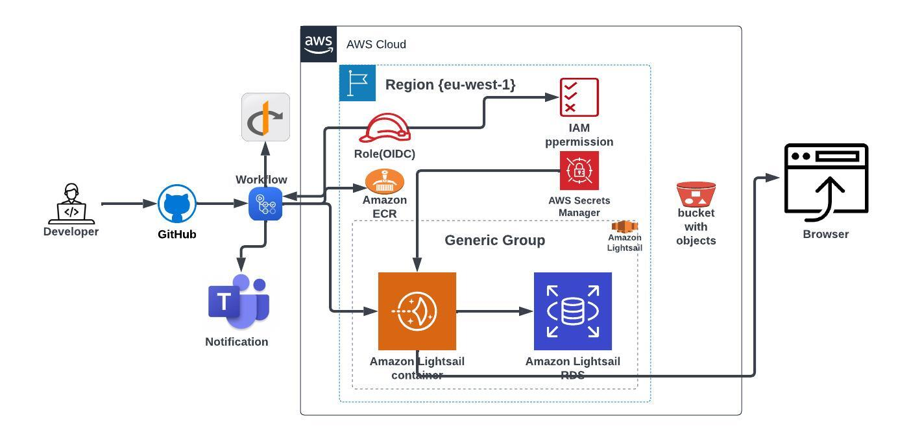

# AWS Lightsail Container Workflow 🚀

This README provides an overview of the "Simple Python Application" workflow to lightsail container, designed to automate the deployment process for a Python-based backend application using GitHub Actions. Additionally, it includes instructions on how to run the application locally using Docker Compose.

## Workflow Description 📌.

The "Simple App" workflow is triggered when there is a push or pull request to the "deploy" branch in your GitHub repository. It performs the following steps:

### Workflow Diagram 💻

Below is a visual representation of the workflow for deploying to Amazon Lightsail:



### Integration Job 🏗

This job is responsible for code linting and validation.

1. **Checkout Code**: Checks out the code from the repository using the `actions/checkout` action.

2. **Setup Python**: Sets up the Python environment with the specified Python version using the `actions/setup-python` action.

3. **Cache Pip Packages**: Caches Python packages to speed up future builds.

4. **Install Package Requirements**: Installs project dependencies using the `make install` command.

5. **Run Linting**: Runs code linting using the `make lint` command.

6. **Lint Dockerfile with Hadolint**: Lints the Dockerfile using the `hadolint/hadolint-action` action.

7. **Slack Notification (On Failure)**: Sends a Microsoft Teams notification in case of a job failure.

### Deploy Job 🚀

This job deploys the application to Amazon Lightsail when there is a push event to the "deploy" branch.

1. **Checkout Code**: Similar to the integration job, it checks out the code.

2. **Upgrade AWS CLI and Setup Lightsailctl**: Installs and sets up the AWS CLI and Lightsailctl for deploying to Amazon Lightsail.

3. **Configure AWS Credentials**: Configures AWS credentials to authenticate the deployment.

4. **Login to Amazon ECR**: Logs in to the Amazon Elastic Container Registry (ECR).

5. **Docker Image Build, Tag, and Push to ECR**: Builds the Docker image, tags it, and pushes it to ECR.

6. **Push the Docker Image to Lightsail**: Pushes the Docker image to Lightsail.

7. **Save Updated LIGHTSAIL_IMAGE_TAG**: Retrieves the image tag from Lightsail and saves it to the environment.

8. **Start New Deployment to Lightsail**: Initiates a new deployment of the container service in Lightsail.

9. **Debug Container Logs Update**: Retrieves and logs container logs from Lightsail for debugging.

10. **Slack Notification (Always)**: Sends a Microsoft Teams notification regardless of job outcome.

## Running the Application Locally ⚙️ 💻

To run the application locally, you can use Docker Compose. Below is a Docker Compose file (`docker-compose.yml`) that defines the application's services and their configurations:

```yaml
version: '3'
services:
  ProjectExceed:
    image: lightsail_app
    build:
      context: .
      dockerfile: ./Dockerfile
    environment: 
      - VERSION=${VERSION}
      # Add other environment variables as needed
    ports:
      - 8000:8000
    command: uvicorn src.asgi:app --host 0.0.0.0 --port 8000 --reload
```

This Docker Compose file defines a service named `lightsail_app` that is built from the `Dockerfile`. It also specifies environment variables required for your application. You can customize the environment variables as needed.

To run the application locally, execute the following command in the same directory as the `docker-compose.yml` file:

```bash
docker-compose up
```

This will start your application, making it accessible at `http://localhost:8000`.

## Why Lightsail?

We have chosen to use Amazon Lightsail for our deployment in the development environment to save costs. Lightsail provides an easy-to-use and cost-effective way to deploy and manage applications in a reliable manner, making it an ideal choice for development environments.

## Dockerfile  📄

The Dockerfile for your application is as follows:

```dockerfile
# Use an official Python runtime as a parent image
FROM python:3.11.4-slim

LABEL org.website="http://devlook.tech"

# Set the working directory in the container
WORKDIR /usr/src/app

# Copy the requirements file into the container at /usr/src/app
COPY requirements.txt .

# Install any needed packages specified in requirements.txt
RUN pip install --no-cache-dir -r requirements.txt

# Copy the rest of the application code into the container at /usr/src/app
COPY . .

# Expose the port that Uvicorn will listen on
EXPOSE 8000

# Set environment variables (customize as needed)
ENV PROJECT_NAME=${PROJECT_NAME}
ENV BACKEND_CORS_ORIGINS=${BACKEND_CORS_ORIGINS}
# Add other environment variables as needed

# Command to run the application using Uvicorn
CMD ["uvicorn", "src.asgi:app", "--host", "0.0.0.0", "--port", "8000"]
```

This Dockerfile sets up the Python environment, installs project dependencies, copies your application code, and specifies environment variables. Customize the environment variables according to your application's requirements.

### Conclusion 📄

This README provides an overview of the "Exceed Backend" workflow for automating the deployment of your Python-based backend application using GitHub Actions. It also includes instructions for running the application locally with Docker Compose. Make sure to adjust the environment variables and configurations to match your specific project requirements.
 
```
Feel free to use this updated Markdown-formatted README for your project.
```


<!-- ```
bash
python3 -m pip install --user virtualenv
# You should have Python 3.7 available in your host.
# Check the Python path using `which python3`
# Use a command similar to this one:
python3 -m virtualenv --python=<path-to-Python3.7> .devops
source .devops/bin/activate
``` -->